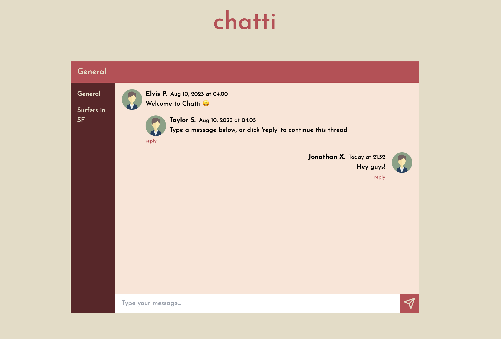

This is my submission for the Typeface Frontend Coding Assessment: 

**Chatti** - a chat app built in NextJS/TS/React

(Jonathan Xie, August 13th 2023)



## Getting Started

Here's how to get 'Chatti' running locally on your machine:

1. Clone the repository
2. Open the project folder
3. Run 'npm i' to install dependencies
4. Run 'npm run build' to create an optimized production build
5. Run 'npm start'
6. Navigate to localhost:3000 to view the app
7. (Optionally, run 'npm run dev' at step 4 to view the app in a dev environment)

## Project Structure

Below is an overview of the main project file structure:

```
chatti/
│
├── public/            # Static files (images, icons)
│
├── src/                 
│   ├── app/           # Next.js App Router (application entry point)
│   ├── components/    # React components 
│   ├── interfaces/    # TypeScript interfaces and types
│   ├── utils/         # Utility functions & helpers
│   ├── tests/         # Jest unit tests 
│   └── data/          # Sample data for development & demonstration purposes
```

## Assumptions

I made the following assumptions designing this app:

- **Single User**
    - Functionality should be limited to self-messaging
- **Persistence**
    - Messages should not persist and chat history will be lost upon refresh
- **Data Format**
    - Sample data should reflect the anticipated structure of messages/users/channels, including elements like user ids, timestamps, message content, etc.
- **User Sign-in**
    - Prompt user for name in a modal instead of implementing sign-in (since a backend is out of scope)
- **Channel Switching**
    - Add channel switching to support extensibility to features such as private/public channels in the future
- **Responsiveness**
    - Ensure a user-friendly experience across different device sizes and orientations
- **UI**
    - Implement an interface similar to Teams or Slack, where a user's own messages are inverted (aligned to the right)
- **Replies**
    - Limit replies to the parent message (instead of allowing replies to replies, e.g. Reddit)

## Libraries/Frameworks

I used the following tech stack:

**Next.js**
- Next.js offers out-of-the-box optimizations such as code-splitting, server-side rendering, image optimizations (i.e. lazy loading via next/image), font optimization (next/font), and improved SEO. We can take advantage of hybrid rendering to, for example, render the Header on the server while rendering the ChatInterface client-side. Additionally, Next.js is popular and offers a large community, making it easy to get help online. Though Next is arguably overkill for our small chat app, it's scalable and its features can be leveraged as the app grows and more features are added.

**React**
- React's reusable component architecture help make development efficient and maintainable. It has a huge, vibrant community and is widely adopted in the industry. It's nice to use, performant, and flexible.

**TypeScript**
- Strong typing becomes more important as the application grows (along with the codebase), i.e. in detecting & preventing errors during development. Intellisense also allows for improved autocompletion and code suggestions. The tradeoff of extra work defining interfaces/types versus JS is worth it, in my opinion.

**Tailwind CSS**
- Unlike Bootstrap or Material UI, Tailwind is utility-first and highly-customizable. Tailwind allows me to quickly style the app in a CSS-like way without actually writing CSS files. For responsive design, I'm able to use utility classes instead of writing media queries.

## Future Improvements

The limited time & scope meant that there were many features left out that I would have liked to add.

**Accessibility**
- As described in the requirements, I prioritized core functionality and UX. Accessibility, however, is a key concern for production-grade applications. Those who rely on assistive technologies will find difficulties using Chatti in its current iteration. Some things I would implement to improve in this area are: more semantic HTML, keyboard navigation, checking for color contrast (following WCAG guidelines), using ARIA attributes, and testing with screen readers.

**User Authentication**
- A real chatting app needs to have users, who should be able to sign up for and log into an account. This would require a database and proper backend architecture, which can then permit data persistence, user authentication, and retention of messages.

**Channels**
- Currently, there is no way to join, leave, and search for new channels. A user interface to switch between channels, with different views based on the selected channel, would be an essential feature for the future. We've already defined the Channel interface to handle private channels, but to fully implement private & public channels as mentioned in the project requirements, we'd need to manage user permissions. Perhaps private channels could require an invite to join. 

**UX**
- Users should have unique avatars, assuming they've uploaded one. User actions should provide immediate feedback (i.e. a button hover effect or a loading spinner). More consideration could be put into improving responsiveness, for example, replying to a thread on mobile is currently clunky. Scrolling on mobile may also be an issue. 
